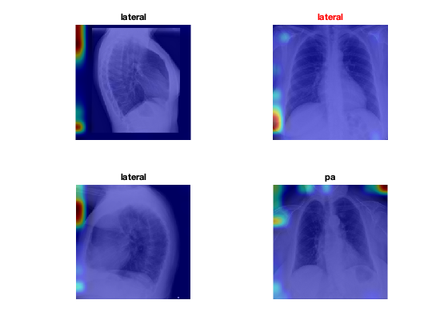
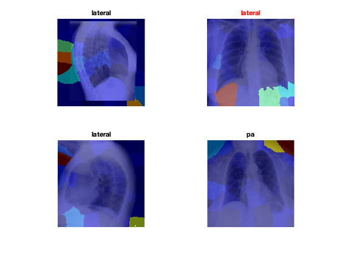

# Explainable AI for Medical Images
This repository shows an example of how to use MATLAB to produce post-hoc explanations (using [Grad-CAM](https://www.mathworks.com/help/deeplearning/ref/gradcam.html) and [image LIME](https://www.mathworks.com/help/deeplearning/ref/imagelime.html)) for a medical image classification task. 

Both methods (`gradCAM` and `imageLIME`) are available as part of the MATLAB Deep Learning toolbox and require only a single line of code to be applied to results of predictions made by a deep neural network (plus a few lines of code to display the results as a colormap overlaid on the actual images).

|  |
|:--:|
| Example of `gradCAM` results.|

|  |
|:--:|
| Example of `imageLIME` results.|
## Experiment objective
Given a chest x-ray (CXR), our solution should classify it into Posteroanterior (PA) or Lateral (L) view. 
### Dataset
A small subset of the [PadChest](https://bimcv.cipf.es/bimcv-projects/padchest/) dataset[1](#myfootnote1).
## Requirements
- [X]  [MATLAB 2020a](https://www.mathworks.com/products/matlab.html) or later
- [X]  [Deep Learning Toolbox](https://www.mathworks.com/products/deep-learning.html)
- [X]  [Deep Learning Toolbox™ Model for SqueezeNet Network support package](https://www.mathworks.com/help/deeplearning/ref/squeezenet.html) 
- [ ]  [Parallel Computing Toolbox](https://www.mathworks.com/products/parallel-computing.html) (only required for training using a GPU)
## Suggested steps
1. Download or clone the repository.
2. Open MATLAB.
3. Edit the contents of the `dataFolder` variable in the `xai_medical.mlx` file to reflect the path to your selected dataset. 
4. Run the `xai_medical.mlx` script and inspect results.
## Additional remarks

- You are encouraged to expand and adapt the example to your needs.
- The choice of pretrained network and hyperparameters (learning rate, mini-batch size, number of epochs, etc.) is merely illustrative.  
- You are encouraged to (use Experiment Manager app to) tweak those choices and find a better solution.
## Notes
<a name="myfootnote1">[1]</a> This example uses a small subset of images to make it easier to get started without having to worry about large downloads and long training times.   
